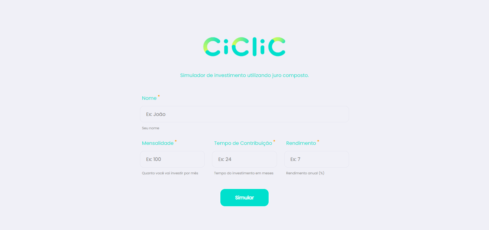
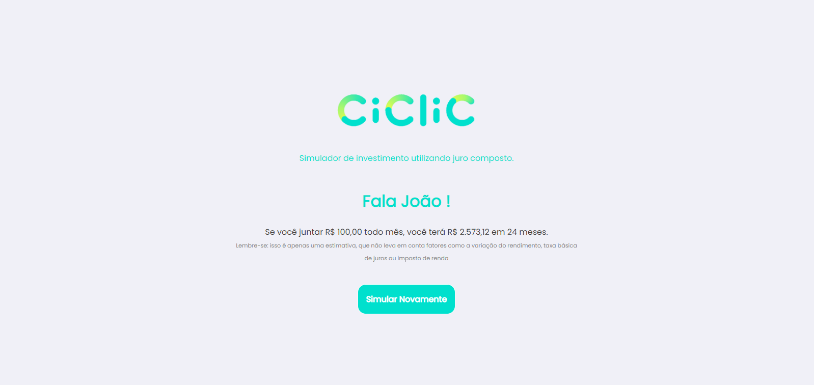

# Simulador de Investimentos - Ciclic

Este projeto foi realizado como um teste para a empresa [@Ciclic](https://github.com/ciclic). Consiste em uma aplicação simples para cálculo de investimento utilizando juro composto.

Você pode acessar o repositório de especificações [aqui](https://github.com/ciclic/test-frontend)

## Sobre o Projeto

O projeto foi realizado com VueJS, sem a utilização de frameworks de CSS. A estilização está feita em SCSS, e pode ser encontrada na pasta `assets/scss`.

Para rodar o projeto é necessário ter o [Node](https://nodejs.org/) instalado na sua máquina.

#### Comandos

```bash
## Instale as dependências
npm install

## Inicie a aplicação
npm run serve
```

### Screenshots

#### Web

<div>
  
  
</div>

#### Mobile

<div>
   
   
</div>

---

<div style="text-align: center">
  Qualquer dúvida, sugestões de melhoria e feedbacks, estou à disposição!
</div>
